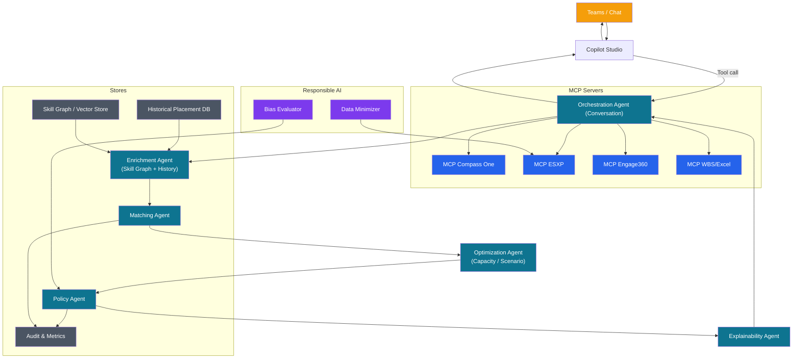
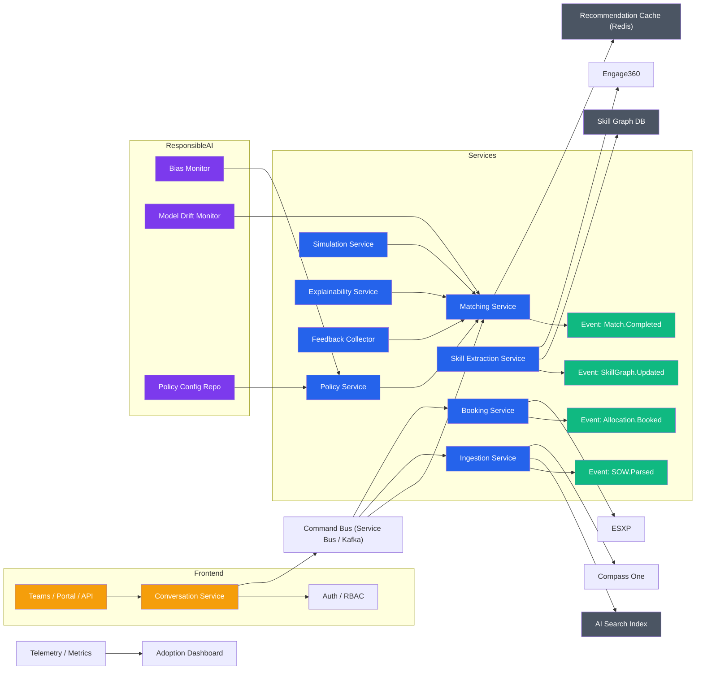
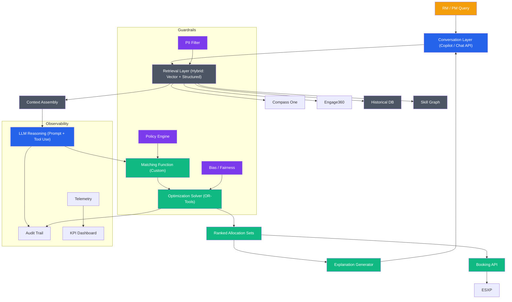
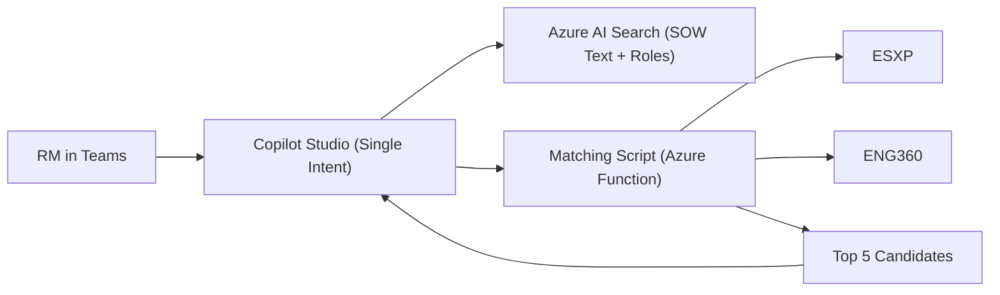
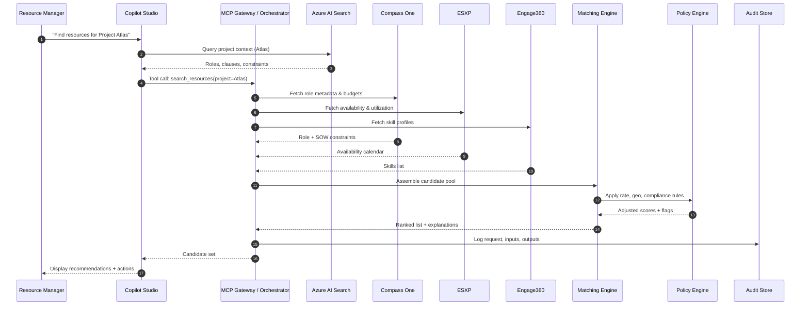
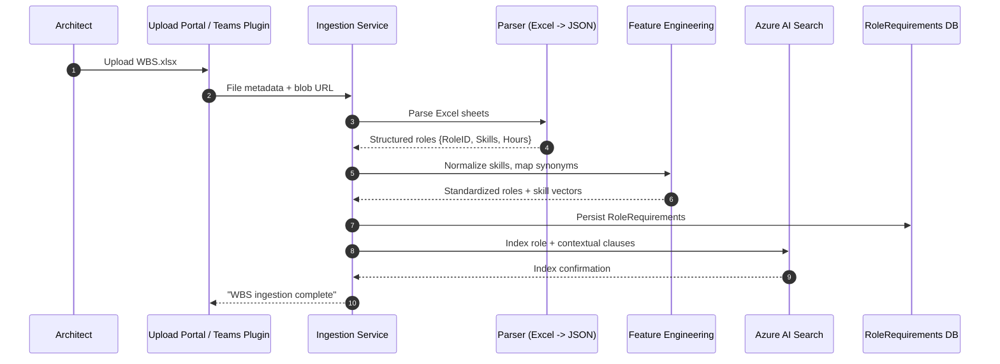
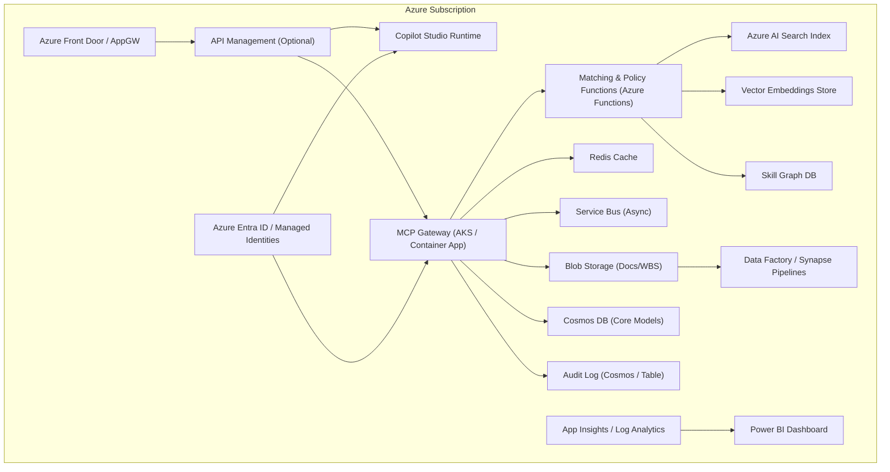

# Re-sourcer Solution Architecture

## 1. Problem Space & Vision
Re-sourcer accelerates and governs resource allocation in a consultancy environment by transforming unstructured Statements of Work (SOW), Work Breakdown Structures (WBS), and skill inventories into actionable, explainable recommendations. The system reduces time-to-fill, improves utilisation, and embeds Responsible AI & compliance.

## 2. Core Domains
- Ingestion & Normalization: Compass One (SOW, WBS), ESXP (forecast, utilisation), Engage360 (skills), Excel WBS uploads, partner data.
- Retrieval & Enrichment: Hybrid RAG (vector + keyword) over clause chunks, skill graph expansion, historical placements and performance signals.
- Matching & Ranking: Availability, skill similarity, proficiency weighting, historical success, diversity and policy constraints.
- Workflow & Transactions: Generate recommendations, create resource requests, perform bookings, update allocation state.
- Governance & Responsible AI: Bias mitigation, privacy, audit, explainability, policy/rate enforcement.
- Observability & Feedback: Telemetry, KPIs, acceptance signals, drift/fairness monitoring.

## 3. Key Quantitative KPIs
- Time-to-fill (request to booking) – target < 30 min (chat latency P95 < 4s)
- Suggestion acceptance rate – target > 60%
- Utilisation uplift – +5–10% billable hours
- Forecast accuracy delta – reduce variance by >15%
- Diversity balance vs target – maintain within ±5% threshold
- Manual intervention / override rate – < 20%
- System reliability – > 99.5% successful tool calls

## 4. Architecture Option 1: Copilot Studio + MCP Gateway (Aggregator)
Best for fast adoption & centralized governance.
```mermaid
flowchart LR
    U["Teams / M365 Chat<br>RM / PM / Exec"] --> CS["Copilot Studio<br>(Intent + Prompt Orchestrator)"]
    CS -->|Grounding Query| RAG["Azure AI Search<br>Compass One Index (Vector+Keyword)"]
    CS -->|Tool Calls (MCP)| GW["MCP Gateway<br>(Unified Server)"]

    subgraph Integration["Gateway Internal Adapters"]
        GW --> C1["Compass One Adapter"]
        GW --> E1["ESXP Adapter"]
        GW --> G1["Engage360 Adapter"]
        GW --> X1["Excel/WBS Upload Handler"]
    end

    C1 --> CO["Compass One APIs / Docs"]
    E1 --> ES["ESXP APIs / Forecast DB"]
    G1 --> EN["Engage360 Skills API"]
    X1 -->|Parse + Extract| IE["Ingestion Engine"]

    IE --> STG["Raw & Parsed Store (Blob + Queue)"]
    STG --> PIPE["Feature Engineering / Skill Normalization"]

    PIPE --> MATCH["Matching & Ranking Engine"]
    GW --> MATCH
    MATCH --> POL["Policy & Rate Engine"]
    POL --> RES["Recommendation Assembly"]

    RES --> AUD["Audit & Explainability Store"]
    GW --> AUD
    AUD --> OBS["App Insights / Log Analytics / Metrics"]

    RES --> CS
    CS --> U

    subgraph Security["Identity & Governance"]
       SEC["Azure Entra ID / RBAC / Conditional Access"] --> GW
       SEC --> CS
       SEC --> POL
    end

    subgraph Data["Responsible AI / Monitoring"]
       FAIR["Bias Checks"] --> POL
       PRIV["PII Scrub / Mask"] --> IE
    end

    classDef primary fill:#2563eb,color:#fff;
    classDef data fill:#4b5563,color:#fff;
    classDef logic fill:#10b981,color:#fff;
    classDef gov fill:#7c3aed,color:#fff;
    classDef out fill:#f59e0b,color:#fff;

    class CS,GW primary
    class RAG,STG,PIPE data
    class MATCH,POL,RES logic
    class AUD,OBS,FAIR,PRIV gov
    class U out
```
Strengths: Single endpoint, cross-system joins, unified audit. Trade-offs: Potential gateway bottleneck – scale horizontally.

## 5. Architecture Option 2: Direct MCP Servers + Multi-Agent Orchestration
Modular; each system exposed separately.

Strengths: High extensibility. Trade-offs: More hops, latency tuning required.

## 6. Architecture Option 3: Event-Driven Microservices + Agent Mesh
For high throughput & batch operations.

Strengths: Resilient, scalable. Trade-offs: Operational complexity.

## 7. Architecture Option 4: Hybrid Retrieval + Optimization (LLM + Solver)
Adds global optimisation for allocation.

Strengths: Optimal solutions; explainable. Trade-offs: Constraint complexity.

## 8. Architecture Option 5: MVP (Lean Start)


## 9. Core Data Model (Conceptual)
- Resource: { ResourceID, Name, Skills[], Proficiency, RateCard, Geo, AvailabilityCalendar, HistoricalProjects[] }
- RoleRequirement: { RoleID, ProjectID, SkillWeights[], StartDate, EndDate, EffortHours, Seniority, Constraints }
- SOWClauseChunk: { ChunkID, ProjectID, Text, Vector, Type, EffectiveDate }
- Recommendation: { ReqID, Candidates[{ResourceID, ScoreBreakdown, AvailabilityWindow, PolicyFlags[], Explanation}] }
- Booking: { BookingID, ResourceID, RoleID, ProjectID, Status, CreatedAt, ApprovedBy }
- PolicyRule: { RuleID, Category, Expression, Version, Active }
- AuditEvent: { EventID, Type, Actor, InputsHash, OutputSummary, Timestamp, LatencyMs }

## 10. Multi-Agent Role Definitions
- Ingestion Agent: Transforms SOW/WBS into structured RoleRequirements + clause vectors.
- Skill Graph Agent: Maintains related skill edges, enabling fuzzy expansion.
- Matching Agent: Combines embeddings + structured filters to create candidate pools.
- Optimization Agent: Solves allocation (maximize coverage, minimize cost/functions).
- Policy Agent: Applies constraints (rate, geo, double-booking, compliance).
- Explainability Agent: Generates human-readable rationale with score breakdown.
- Forecast Simulation Agent: Projects utilisation impact if booked.
- Feedback Agent: Captures accept/reject signals to improve models.

## 11. Responsible AI Integration
- Bias tracking across geo, seniority, diversity attributes.
- Score breakdown transparency (SkillMatch%, Availability%, History%, PolicyAdjustments%).
- Privacy: Attribute minimization & masking for non-essential flows.
- Override & Escalation: Manual adjustments logged to audit.
- Lifecycle: Fairness & drift review cadence (monthly/quarterly).

## 12. Key Sequence: Find Resources


## 13. Key Sequence: Upload Excel WBS


## 14. Deployment View (Option 1 Example)


## 15. MCP Tool Schema (Illustrative)
```json
{
  "tools": [
    {
      "name": "search_resources",
      "inputSchema": {
        "type": "object",
        "properties": {
          "projectId": {"type": "string"},
          "roleId": {"type": "string"},
          "startDate": {"type": "string", "format": "date"},
          "endDate": {"type": "string", "format": "date"},
          "maxCandidates": {"type": "integer", "default": 10}
        },
        "required": ["projectId", "roleId", "startDate", "endDate"]
      },
      "outputSchema": {
        "type": "object",
        "properties": {
          "candidates": {
            "type": "array",
            "items": {
              "type": "object",
              "properties": {
                "resourceId": {"type": "string"},
                "score": {"type": "number"},
                "skillMatch": {"type": "number"},
                "availabilityWindow": {"type": "string"},
                "rate": {"type": "number"},
                "policyFlags": {"type": "array", "items": {"type": "string"}},
                "explanation": {"type": "string"}
              }
            }
          }
        }
      }
    }
  ]
}
```

## 16. Recommended Roadmap
1. MVP: Ingestion (Compass One + ESXP), heuristic matching, manual booking.
2. Gateway: MCP + vector index, audit, basic policy engine.
3. Expansion: Skill graph, historical weighting, fairness metrics.
4. Optimization: Add solver + simulation agent.
5. Ecosystem: Partner integration adapters, demand forecasting.
6. Learning Loop: Feedback-driven model tuning, drift & fairness automation.

## 17. Risks & Mitigations
| Risk | Mitigation |
|------|------------|
| Data freshness lag | Delta event ingestion, staleness alarms (>2h) |
| Policy drift | Versioned rules, feature flags, rollback plan |
| Latency spikes | Precompute availability snapshots, Redis cache, async pipelines |
| Bias emergence | Weekly fairness reports, threshold adjustments |
| Excel variability | Template validator + fallback LLM parsing |
| Gateway bottleneck | Horizontal scale, circuit breakers, bulk endpoints |

## 18. Technology Stack Summary
- LLM: Azure OpenAI (GPT-4.1 / o3-mini) for reasoning vs cost trade-offs.
- Embeddings: text-embedding-3-large for clauses & skills.
- Matching: Hybrid filters + cosine similarity; candidate pre-filter in SQL/Redis.
- Optimization: OR-Tools (Python) behind MCP tool `optimize_allocation`.
- Storage: Cosmos DB (core), Blob (docs), Redis (hot cache), AI Search (retrieval).
- Graph: Neo4j or Cosmos Gremlin for skill adjacency.
- Telemetry: App Insights, custom KPIs exported to Log Analytics + Power BI.

## 19. Selection Guidance
- Need speed/governance → Option 1
- Need modular experimentation → Option 2
- Need batch & resiliency → Option 3
- Need global optimal allocations → Option 4
- Need quick stakeholder demo → Option 5

## 20. Next Enhancements (Future Appendix)
- Policy DSL (CEL) examples
- Fairness score formula sample
- Cosmos DB container schemas
- Partner adapter contract spec

---
End of Architecture Document
