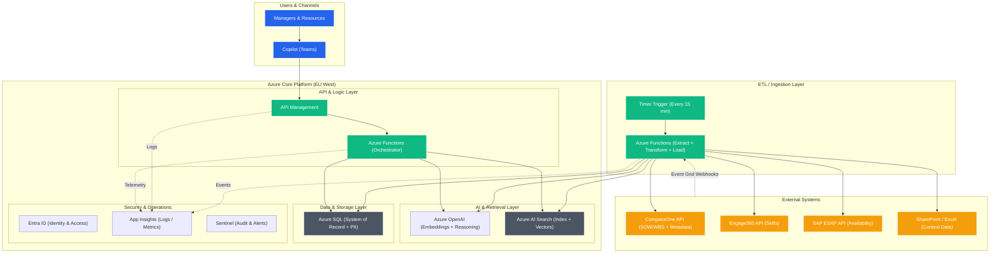
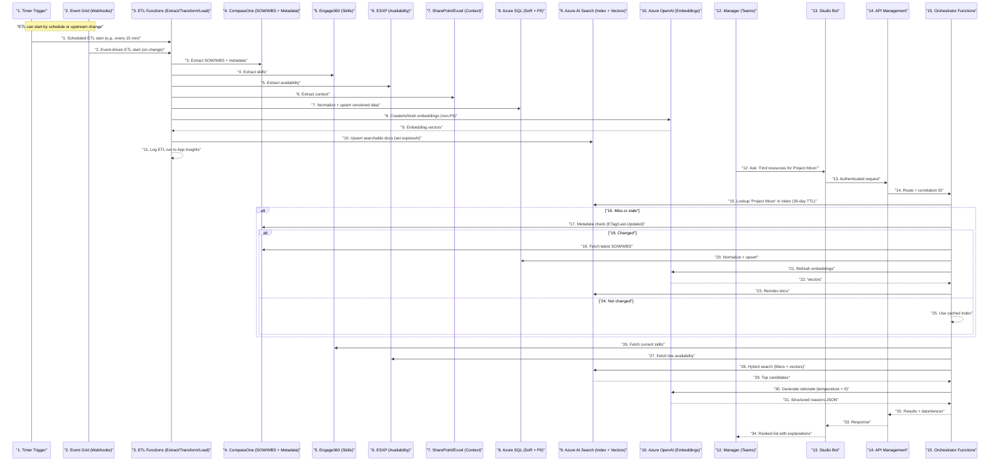

# 🧩 Product Requirements Document — Resourcer - Using Azure

## 1. Overview

**Goal:**  
Resourcer simplifies how **Resource Managers** and **Resources (employees/consultants)** match skills to project needs. It unifies fragmented staffing data across systems and provides a conversational Copilot experience to find the best project–person fit.

**Target Users:**  
- **Resource Managers:** Need to identify available people for active projects.  
- **Resources:** Want to find projects matching their skills and upcoming availability.

**Business Value:**  
Faster staffing decisions, reduced duplication, and better utilization of people and skills.  
All data remains inside the enterprise’s Azure tenant with full audit and compliance visibility.

---

## 2. Problem Statement

Resource allocation today is fragmented across multiple tools:
- **ESXP (SAP)** → resource availability and forecast.  
- **Engage360** → resource skills and experience.  
- **CompassOne** → project SOWs and Work Breakdown Structures.  
- **Excel/SharePoint** → manual context and exceptions.

This leads to duplicated work, inconsistent data, and delayed decisions.

---

## 3. Proposed Solution

Resourcer connects to all existing systems and provides a **Copilot chatbot** (in Teams or web) where users can type queries like:

> “Find available data engineers for Project Alpha in November.”  
> “Show me projects needing Power BI expertise next month.”

The system interprets natural language, gathers and validates data from each source, and displays ranked matches between **roles** and **resources**, including rationale and data freshness.

---

## 4. Key Features (MVP)

- Unified data integration from ESXP, Engage360, CompassOne, and Excel.  
- Real-time availability and skill matching.  
- Natural-language conversational interface via Microsoft Copilot.  
- Automated ranking and rationale for each match.  
- Intelligent caching with 30-day TTL and freshness checks.  
- Versioned audit trail of all staffing decisions.

---

## 5. Architecture Overview

### 5.1 High-Level Diagram

---

## 6. Data Flow & Logic

### 6.1 Sequence (simplified)

### 6.2 Explanation
| # | Step | Description |
|---|------|-------------|
| **1** | Timer Trigger | The ETL process starts automatically on a fixed schedule (e.g., every 15 minutes). |
| **2** | Event Grid (Webhooks) | ETL can also start instantly when external systems (e.g., CompassOne) publish update events. |
| **3** | Extract SOW/WBS + metadata | Azure Functions call CompassOne APIs to get project scope, roles, and latest metadata (ETag, LastUpdated). |
| **4** | Extract skills | Functions pull updated employee skills and certifications from Engage360. |
| **5** | Extract availability | Functions fetch current availability and forecasts from ESXP (SAP). |
| **6** | Extract context | Retrieves supplemental information from SharePoint or Excel files used by managers. |
| **7** | Normalize + upsert data | Data is cleaned, merged, and versioned before being saved in Azure SQL (System of Record). |
| **8** | Create/refresh embeddings | Non-PII text fields (role descriptions, skills, SOW summaries) are embedded using Azure OpenAI. |
| **9** | Embedding vectors | OpenAI returns vector representations for semantic search. |
| **10** | Upsert searchable docs | Azure Functions update Azure AI Search with new or refreshed vectorized documents. |
| **11** | Log ETL run | Each ETL job logs status, duration, and volume in App Insights for monitoring. |
| **12** | Manager query | A manager in Teams asks a question such as “Find resources for Project Moon.” |
| **13** | Copilot request | Copilot Studio securely sends the query to API Management with the user’s identity context. |
| **14** | Route to orchestrator | API Management authenticates and routes the request to the orchestrator Function. |
| **15** | Lookup in index | The orchestrator checks Azure AI Search for a cached copy of “Project Moon” (30-day TTL). |
| **16** | Cache miss or stale data | If data is missing or outdated, a metadata check is triggered. |
| **17** | Metadata check | CompassOne metadata (ETag or LastUpdated) is queried to verify freshness. |
| **18** | Change detected | If CompassOne reports a new version, the orchestrator refreshes data. |
| **19** | Fetch latest SOW/WBS | The updated project and role details are retrieved from CompassOne. |
| **20** | Normalize & save | Data is standardized again and stored in Azure SQL with a new version record. |
| **21** | Refresh embeddings | Updated text fields are re-embedded through Azure OpenAI. |
| **22** | Receive vectors | Azure OpenAI returns new vector representations for Search indexing. |
| **23** | Reindex documents | Updated content is upserted into Azure AI Search for quick semantic retrieval. |
| **24** | No change detected | If metadata matches, cached data remains valid. |
| **25** | Use cached index | The orchestrator proceeds using the current index without re-fetching. |
| **26** | Fetch skills | Live skills data is fetched again from Engage360. |
| **27** | Fetch availability | Real-time availability is retrieved from ESXP for accuracy. |
| **28** | Hybrid search | The orchestrator performs combined keyword and vector search across the index. |
| **29** | Receive ranked candidates | Azure AI Search returns a ranked list of matching people. |
| **30** | Generate rationale | Azure OpenAI produces a deterministic explanation (“why” each match fits). |
| **31** | Structured JSON reasons | The model output is formatted into structured JSON for display. |
| **32** | Send results to API Management | The orchestrator returns the complete response with version and telemetry IDs. |
| **33** | Copilot response | API Management passes the result back to the Copilot Bot. |
| **34** | Display to manager | The Copilot presents the ranked list and explanations to the manager in Teams. |

---

## 7. Azure SQL Role in the Architecture

- **System of Record:** All normalized project, role, and person data is persisted here before indexing.  
- **Audit and Versioning:** Keeps `etag`, `lastUpdated`, and `contentHash` to verify if SOWs changed.  
- **Normalization Hub:** Aligns skill taxonomies from Engage360 and CompassOne.  
- **PII Boundary:** Holds all sensitive personal information; Azure AI Search contains only anonymized summaries.  
- **Reindex Source:** Supports fast rebuilds of AI Search without recalling all APIs.  
- **Analytics:** Enables Power BI reporting for staffing velocity, project utilization, and match accuracy.

---

## 8. Security & Compliance

- **Identity:** Entra ID SSO for users and Managed Identity for services.  
- **Secrets:** Stored in Azure Key Vault.  
- **Audit:** Every query, API call, and data change logged in App Insights; exported to Microsoft Sentinel.  
- **GDPR:** Personal data processed only in SQL; all AI Search data is non-PII.

---

## 9. Observability & Operations

- **App Insights:** Logs, metrics, and correlation IDs for full traceability.  
- **Timer Jobs:** Handle cache expiry (30 days), periodic reindexing, and stale cleanup.  
- **Power BI Dashboards:** Monitor query volume, match accuracy, cache hit ratio, and data freshness.  
- **CI/CD:** GitHub Actions deploy Functions, APIM, and Search indexes with version control.  
- **Alerting:** Latency or API error thresholds trigger notifications.

---

## 10. Risks & Mitigations

| Risk | Mitigation |
|------|-------------|
| CompassOne API latency or downtime | 30-day cached index with metadata freshness checks |
| Data schema changes across systems | Central normalization layer + mapping tables |
| OpenAI cost escalation | Pre-computed embeddings, batch operations |
| Data drift or outdated SOW | Metadata ETag verification before reuse |
| Vendor lock-in | Modular API layer to port to alternative AI services if needed |

---

## 11. Options & Trade-offs

- **Hybrid (recommended):** Pre-ingest stable data + on-demand refresh for freshness.  
- **Real-time only:** Simpler, but high latency and fragile.  
- **Batch ETL:** Cheaper but not suitable for near-real-time staffing.

---

## 12. Pros & Cons

**Pros:**  
- Enterprise-grade compliance and auditability.  
- Fast response (<500 ms).  
- Freshness validation with minimal API calls.  
- Clear separation of concerns (SQL = truth, Search = speed).  

**Cons:**  
- Higher ops overhead for embeddings and TTL management.  
- Dual-store complexity.
- CompassOne metadata dependency.
---

## 13. Multi-Agent vs Single-Agent Architecture

- **MVP:** Single-agent Copilot (retrieval + reasoning).  
- **Future:** Expand to multi-agent (Planner / Retriever / Reviewer).  
  - Planner: interpret intent and compose sub-tasks.  
  - Retriever: orchestrate hybrid queries.  
  - Reviewer: verify accuracy and bias.  
- **Execution:** Host agents on Azure Functions, coordinate via Event Grid, evaluate through Azure AI Foundry.

---

## 14. Presentation Summary (Non-Technical)

**Business View:**  
Resourcer consolidates project staffing data into one conversational Copilot. Managers can find qualified, available people instantly without switching tools, and employees can discover projects that match their skills.

**How It Works (Simple Explanation):**  
When a manager asks about a project, Resourcer checks if that project’s data is up to date. If not, it fetches the latest statement of work, refreshes its secure index, and matches it against people’s skills and availability.  
The response is fast, accurate, and version-tracked, so every decision is auditable and compliant.

# Recommendation
Here is a structured **comparison** between the two Resourcer solution architectures:

* **Solution A — Azure-based Hybrid Architecture**
* **Solution B — Copilot Studio–only (Power Platform) Architecture**

---

## 🔍 Comparison Overview

| Area                       | **Solution A — Azure Architecture**                                                   | **Solution B — Copilot Studio Only**                               |
| -------------------------- | ------------------------------------------------------------------------------------- | ------------------------------------------------------------------ |
| **Core Stack**             | Azure OpenAI, Azure AI Search, Azure Functions, API Management, Azure SQL, Event Grid | Copilot Studio, Dataverse, Power Automate, Custom Connectors       |
| **Integration Style**      | API-based orchestration with Functions and APIM                                       | Low-code connectors and Power Automate actions                     |
| **Data Layer**             | Azure SQL (system of record) + AI Search (semantic index)                             | Dataverse tables (Projects, Roles, People, Audit)                  |
| **AI Reasoning**           | Azure OpenAI (GPT + embeddings) + hybrid search ranking                               | Prompt templates inside Copilot Studio topics                      |
| **Caching & TTL**          | 30-day cache in Azure AI Search; ETag freshness checks                                | 30-day TTL cache in Dataverse; metadata refresh per query          |
| **Hosting**                | Fully on Azure (scalable, enterprise-grade)                                           | Entirely within Microsoft 365 / Power Platform                     |
| **Channels**               | Copilot Studio front-end (Teams)                                                      | Copilot Studio (Teams)                                             |
| **Performance Target**     | <500 ms p95 (due to AI Search and pre-ingested data)                                  | 1–2 s expected due to connector and Power Automate latency         |
| **Data Residency**         | Azure EU West                                                                         | Dataverse EU region                                                |
| **Security Model**         | Entra ID + Managed Identities + Key Vault                                             | Entra ID via Teams + DLP policies on connectors                    |
| **Observability**          | App Insights, Sentinel, Power BI telemetry                                            | Copilot Studio analytics + Power BI on Dataverse                   |
| **Extensibility**          | High—custom code, multi-agent, Azure AI Foundry integration                           | Moderate—limited to Power Automate and connectors                  |
| **Skill Matching Quality** | High (vector + semantic search)                                                       | Medium (rule-based + language prompt ranking)                      |
| **Maintenance Overhead**   | Requires DevOps & cloud engineering                                                   | Low-code admin manageable by citizen developers                    |
| **Cost Model**             | Pay per Azure consumption (Functions, OpenAI tokens)                                  | Pay per Power Platform licenses and API calls                      |
| **Scalability**            | High—serverless auto-scale                                                            | Moderate—limited by Power Automate throughput and connector quotas |
| **Vendor Lock-in**         | Stronger (Azure services)                                                             | Weaker (within M365, less custom code)                             |
| **Best Fit For**           | Large-scale enterprise AI workloads                                                   | Departments or pilots leveraging M365 only                         |

---

## ✅ Pros & ❌ Cons Summary

### **Solution A — Azure Hybrid**

**Pros**

* High performance and scalability.
* Semantic ranking with Azure AI Search.
* Clear separation between system of record (SQL) and search index.
* Full observability and audit trail.
* Easily extendable to multi-agent or AI Foundry governance.

**Cons**

* Requires cloud engineering skills.
* Higher operational and compute cost.
* More complex deployment and monitoring stack.
* Heavier governance (APIM, Key Vault, Functions).

---

### **Solution B — Copilot Studio Only**

**Pros**

* 100% inside Microsoft 365; low setup effort.
* No custom Azure infrastructure to manage.
* Quick time-to-value; citizen developers can maintain it.
* Built-in DLP and Entra ID integration.
* Great for PoC or departmental rollouts.

**Cons**

* Lacks semantic vector search (less precise matching).
* Limited telemetry, scaling, and async orchestration.
* Power Automate and connector throttling can add latency.
* Harder to evolve into complex multi-agent scenarios.
* Dataverse storage cost and API quota can grow with scale.

---

## 🧭 Recommendation

| Phase                     | Recommended Approach          | Rationale                                                                     |
| ------------------------- | ----------------------------- | ----------------------------------------------------------------------------- |
| **MVP / Pilot**           | **Copilot Studio Only**       | Fast to deploy, low-code, validates UX and value proposition.                 |
| **Scale-Up / Production** | **Azure Hybrid Architecture** | Enables semantic search, higher concurrency, data lineage, and AI governance. |

---

### Summary Statement

Use **Copilot Studio** for rapid experimentation and business validation, but migrate to the **Azure Hybrid** architecture once you need real-time semantic search, multi-agent orchestration, or enterprise-scale observability.

Both architectures share the same logical flow and compliance model; they differ in **depth of AI reasoning**, **scalability**, and **operational control**.
