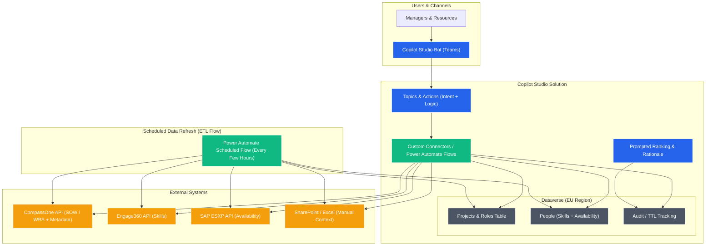
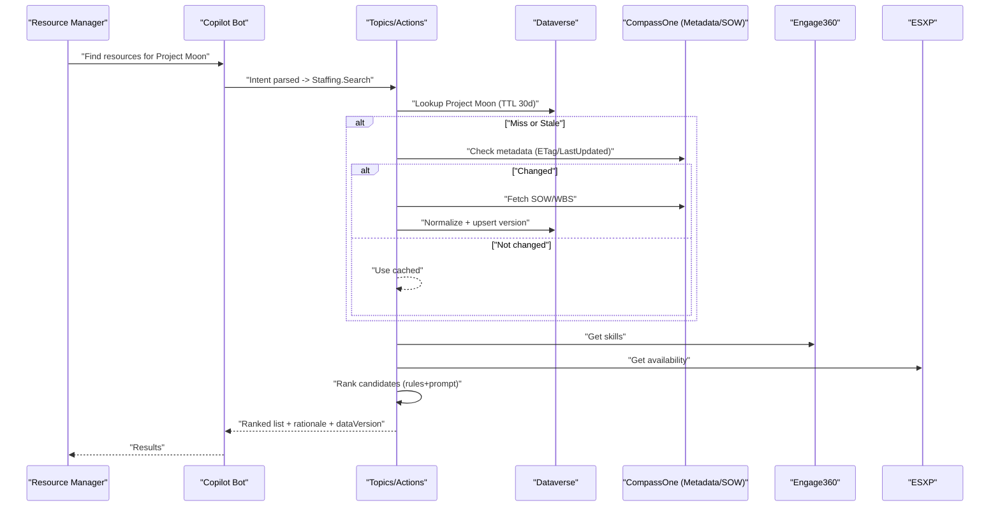

# 🧩 Product Requirements Document — Resourcer - Using Copilot Studio

### 1. Assumptions & Open Questions

**Assumptions:** Only Copilot Studio + Power Platform. Data via standard/custom connectors. Dataverse available EU region. Read-only MVP with 30-day TTL cache and freshness checks.
**Open:** SAP/CompassOne/Engage360 API details,taxonomy alignment.

### 2. High-Level Technical Architecture (Building Blocks)

### 3. Process Diagram (Order of Things)

### 4. Component Explanations

* **Copilot Bot:** Entry point in Teams; handles NLU, grounding, and response formatting.
* **Topics & Actions:** Declarative orchestration; calls connectors and Power Automate flows.
* **Custom Connectors:** Wrap CompassOne/Engage360/ESXP; include metadata HEAD and SOW GET.
* **Dataverse:** System of record, cache (TTL), audit, and taxonomy mapping.
* **Prompted Ranking:** Copilot Studio formats features and generates rationale deterministically.

#### 4.1 ETL Explanation
| Step  | Action                  | Description                                                                             |
| ----- | ----------------------- | --------------------------------------------------------------------------------------- |
| **1** | **ETL Trigger**         | A Power Automate flow runs every few hours (or nightly).                                |
| **2** | **Fetch from Sources**  | Calls CompassOne, Engage360, ESXP, and Excel APIs through connectors.                   |
| **3** | **Normalize Data**      | Cleans, maps, and standardizes fields (skills, roles, availability).                    |
| **4** | **Upsert to Dataverse** | Updates the `Projects`, `Roles`, and `People` tables; sets a `expiresAt` value for TTL. |
| **5** | **Audit Record**        | Writes timestamps and row counts to `Audit` table for monitoring.                       |
| **6** | **Ready for Copilot**   | When users ask questions, Copilot queries Dataverse directly — no live API needed.      |

### 5. Security & Compliance

Entra ID SSO via Teams. DLP policies restrict connectors. Environment in EU region. Dataverse row-level security. Secrets stored as connector credentials; least-privilege scopes. Audit tables log queries and versions.

### 6. Observability & Operations

Copilot Studio analytics (transcripts, CSAT). Dataverse audit tables for decisions and TTL state. Power BI on Dataverse for p95, cache hit ratio, freshness age. Solution export for ALM; pipelines for Dev→Test→Prod.

### 7. Risks & Mitigations

* Connector throttling → Backoff + per-user rate limits in actions.
* Schema drift → Versioned connectors; contract tests in flows.
* Latency without vector index → Precompute normalized features in Dataverse; light scoring rules before prompt.
* Stale data → 30-day TTL + metadata check each query.
* Vendor lock-in → Keep business rules in Dataverse tables, not hardcoded prompts.

### 8. Options & Trade-offs

* **Dataverse-only ranking:** Lowest cost, simpler; less semantic nuance.
* **Prompt-assisted ranking (chosen):** Better explanations; small model cost; no Azure AI Search.

### 9. Pros & Cons

**Pros:** Single platform, low-code, fast ALM, native Teams, strong governance.
**Cons:** No vector search; complex ranking relies on rules + prompts; throughput bound by connector limits.

### 10. Multi-Agent vs Single-Agent

Stay **single agent** in Copilot Studio with multiple **Actions**. Consider sub-bots (skills) later: *Planner* topic, *Retriever* action set, *Reviewer* topic for QA.

### 11. Presentation Summary

Resourcer in Copilot Studio lets managers ask for talent in plain English. It checks a cached project record in Dataverse, validates if CompassOne changed, pulls skills and availability, ranks candidates, and explains why.
All within Microsoft 365 and Power Platform governance, no extra Azure services required.
