# Feedback

What went well?
Liked the idea about how SoW is uploaded and skill details and possible resources and other details are shown. Saves time and tells an RM what is skills.
The project demonstrates a high-impact, innovative use of Agentic AI to transform workforce planning and resource deployment. It clearly aligns with Microsoft’s internal productivity and scalability goals, offering tangible business value through faster staffing, better utilisation, and smarter decision-making.
The storytelling, name, and vision are compelling, and the roadmap shows strong foresight with planned integrations into key Microsoft systems like Compass One and ESXP.

What can the team improve
Explore the feasibility with connectivity on OneProfile so that you can get more accurate match. Also possibility reading possibility of past GRMs and resources assigned for skills to make it more accurate match. We use lot of partners, what about that?
The team can enhance the solution by adding technical depth (detailed architecture, AI model specifics) and a clearer articulation of Responsible AI practices (bias mitigation, data privacy). Additionally, including quantitative KPIs and long-term adoption metrics will make the impact and sustainability even more convincing.

## Summary
### **What went well**
- Efficient SoW upload process with clear skill/resource details.
- Saves time and improves visibility for Resource Managers.
- Innovative use of Agentic AI for workforce planning and resource deployment.
- Strong alignment with Microsoft’s productivity and scalability goals.
- Tangible business value: faster staffing, better utilisation, smarter decisions.
- Compelling storytelling, vision, and roadmap with planned integrations (Compass One, ESXP).

### **What can improve**
- Enhance connectivity with **OneProfile** for more accurate matching.
- Consider historical GRMs and resource assignments for better accuracy.
- Address partner integration for broader coverage.
- Add **technical depth** (architecture, AI model specifics).
- Clearly articulate **Responsible AI practices** (bias mitigation, data privacy).
- Include **quantitative KPIs** and long-term adoption metrics for impact and sustainability.

### 🔍 Action Plan for Improvements
1. **Integration & Accuracy**
   - Explore OneProfile connectivity.
   - Incorporate historical GRM/resource data.
   - Assess partner integration feasibility.

2. **Technical Enhancements**
   - Document detailed architecture and AI model specifics.
   - Strengthen Responsible AI compliance (bias, privacy).

3. **Measurement & Adoption**
   - Define quantitative KPIs.
   - Establish long-term adoption metrics.

-----------

## Research

## Important / To  Do
   Include the other hackathon about SOW
   Need to write the OKR / business impact

   

   

## Objectives

### Target Idea 1 A 

### Target Idea 1B

```mermaid
flowchart TD
    %% ===== USER LAYER =====
    A1["Teams / M365 Chat<br>PM / RM / Exec"] -->|Prompt / Request| A2["Copilot Studio"]

    %% ===== COPILOT STUDIO =====
    subgraph A["Copilot Studio Layer"]
    A2 -->|Intent & Orchestration| A3["Prompt Orchestrator"]
    A3 -->|Grounds query| A4["RAG - Azure AI Search"]
    A3 -->|Calls tools| B1["MCP Gateway"]
    end

    %% ===== KNOWLEDGE LAYER =====
    subgraph B["Knowledge & Retrieval Layer"]
    A4 -->|Retrieve & Cite| B2["Compass One – SOW & Contract Index"]
    B2 -->|Source of Truth| B3["Compass One Document Store"]
    end

    %% ===== MCP LAYER =====
    subgraph C["MCP Integration Layer"]
    B1 --> C1["MCP – Compass One Adapter"]
    B1 --> C2["MCP – ESXP Adapter"]
    C1 --> D1["Compass One System<br>SOW, Contracts, Deliverables"]
    C2 --> D2["ESXP System<br>Skills, Forecast, Availability"]
    end

    %% ===== BUSINESS LOGIC =====
    subgraph D["Core Logic & Governance Layer"]
    A3 --> D3["Business Rules & Validation"]
    D3 --> D4["Policy Engine<br>Rates, Approvals"]
    D4 --> D5["Audit & Telemetry Store"]
    end

    %% ===== SECURITY & GOVERNANCE =====
    subgraph E["Security & Identity Layer"]
    E1["Azure Entra ID<br>AuthN & RBAC"] -->|Token Delegation| A2
    E1 -->|Scoped Access| B1
    E1 -->|Policy Check| D3
    end

    %% ===== MONITORING =====
    subgraph F["Monitoring & Ops Layer"]
    F1["App Insights / Log Analytics"]
    F1 --> D5
    end

    %% ===== OUTPUTS =====
    A3 -->|Summarized Answer + Actions| A1
    A3 -->|Approved Allocations| C2

    %% ===== STYLING =====
    classDef main fill:#2563eb,stroke:#fff,stroke-width:1px,color:#fff;
    classDef data fill:#4b5563,stroke:#fff,stroke-width:1px,color:#fff;
    classDef mcp fill:#0891b2,stroke:#fff,stroke-width:1px,color:#fff;
    classDef logic fill:#10b981,stroke:#fff,stroke-width:1px,color:#fff;
    classDef sec fill:#7c3aed,stroke:#fff,stroke-width:1px,color:#fff;
    classDef out fill:#f59e0b,stroke:#fff,stroke-width:1px,color:#fff;

    class A2,A3 main
    class B1,C1,C2 mcp
    class B2,B3,D1,D2 data
    class D3,D4,D5 logic
    class E1 sec
    class A1 out
```

### Explanation
Below is the complete sequential flow — including **content ingestion prerequisites** — for the process that occurs when a Resource Manager asks Copilot:  
> “Help me find resources for the following project "XXXX".”

---

## ⚙️ Phase 0 — Prerequisites & Content Ingestion

Before Copilot can answer intelligently, the foundational data pipelines and connections must exist.

1. **Compass One Data Access Setup**
   - Expose SOWs, Contracts, Deliverables, and Role data via API or export.
   - Define metadata fields: `ProjectID`, `Client`, `RoleTitle`, `StartDate`, `EndDate`, `Budget`, `Clauses`, `Deliverables`.

2. **SOW & Contract Content Ingestion (RAG Layer)**
   - Extract Compass One documents (PDF, DOCX, etc.).
   - Convert to text and chunk by clause or section.
   - Enrich with metadata (Project ID, document version, effective date, deliverable type).
   - Generate vector embeddings and push to **Azure AI Search** (vector + keyword index).
   - Store original documents in a **Compass One Document Store** (Blob, SharePoint, or DMS).
   - Automate ingestion via triggers for new or updated SOWs.

3. **ESXP Data Preparation**
   - Expose skill, forecast, and utilization data through API or export.
   - Normalize: `SkillName`, `Level`, `Availability%`, `BillableFlag`.
   - Optionally cache in read-optimized database for faster queries.

4. **MCP Server / Gateway Configuration**
   - Register MCP adapters:
     - `mcp-compass-one` → project, SOW, and role data.
     - `mcp-esxp` → people, skills, and forecast data.
   - Optionally implement a unified **MCP Gateway** for orchestration and logging.

5. **Core Logic & Policy Setup**
   - Define and store business rules: rate caps, location policies, double-booking checks, approvals.
   - Store rules in versioned JSON or within a rules engine.
   - Configure access control and approval routing.

6. **Copilot Studio Setup**
   - Define intents/topics: “Find resources”, “Check SOW details”, “Book resource”.
   - Connect Copilot Studio to MCP servers or the unified Gateway.
   - Link to **Azure AI Search** for retrieval grounding (RAG).
   - Secure all connections via **Entra ID** authentication.

7. **Monitoring & Audit Readiness**
   - Enable **App Insights** telemetry for runtime health.
   - Create an **Audit Store** for recording decisions and actions.

---

## 💬 Phase 1 — Request & Intent Recognition

1. The **Resource Manager** in Teams asks Copilot:  
   _“Help me find resources for Project Atlas.”_
2. **Copilot Studio** receives the message and passes it to the **Prompt Orchestrator**.
3. The **Orchestrator** identifies the request as a **resourcing search intent**.

---

## 📄 Phase 2 — Retrieve Project Context (RAG)

4. The Orchestrator queries **Azure AI Search (Compass One Index)** using the project name or ID.
5. **Azure AI Search** returns relevant data:
   - Roles, durations, deliverables, and budgets.
   - Clause-level constraints and policies.
6. The Orchestrator structures this into a contextual payload for decision-making.

---

## 🔌 Phase 3 — MCP Gateway Coordination

7. The Orchestrator sends a structured tool call to the **MCP Gateway**:  
   `search_resources(project="Atlas", role="Data Engineer", startDate, endDate)`
8. The **MCP Gateway** orchestrates:
   - Calls to **MCP ESXP Adapter** (skills and availability).
   - Calls to **MCP Compass One Adapter** (project constraints and budgets).

---

## 🧠 Phase 4 — Data Retrieval from Source Systems

9. **ESXP Adapter → ESXP System**
   - Retrieve people, skills, rates, and availability.
10. **Compass One Adapter → Compass One System**
    - Retrieve SOW deliverables, role metadata, budgets, and client clauses.
11. Both adapters normalize results and return structured data to the **MCP Gateway**.

---

## 🧩 Phase 5 — Core Logic & Governance

12. The **MCP Gateway** forwards all data to the **Core Logic & Governance** layer.
13. **Core Logic** evaluates:
    - Skill match.
    - Availability within project window.
    - Budget and rate constraints.
    - Policy exceptions (remote work, security clearance, region).
14. **Policy Engine** ranks candidates by fit and compliance.
15. **Audit Store** logs:
    - Inputs (query, project, role).
    - Rule results and rationale.
    - User and timestamp.

---

## 💡 Phase 6 — Copilot Response

16. **Core Logic** returns the shortlisted candidates and reasoning.
17. **MCP Gateway → Orchestrator → Copilot Studio** chain returns a user-facing summary.
18. **Copilot Studio** displays:
    - Candidate list with rationale (skills, rate, availability).
    - Next-step actions (“Book resource”, “Show alternatives”, “Open in ESXP”).

---

## 📘 Phase 7 — Booking Workflow

19. The Resource Manager selects **“Book this resource.”**
20. **Copilot Studio → Orchestrator → MCP Gateway** sends `create_allocation()` call.
21. **Core Logic** validates:
    - Budget and utilization.
    - Compliance with policies.
    - Approval routing (if required).
22. **MCP Gateway** executes:
    - Write to **ESXP** (create booking record).
    - Update **Compass One** (mark SOW role as filled).
23. Both systems return confirmation and booking reference IDs.

---

## 🧾 Phase 8 — Audit & Confirmation

24. **MCP Gateway** logs all booking actions in the **Audit Store**.
25. **Copilot Studio** sends confirmation to the user in Teams:  
    _“Jane Doe booked successfully for Project Atlas (Nov–Dec).”_
26. **App Insights** records runtime telemetry (latency, success/failure, system health).

---

## 🔍 Summary Overview

| Layer | Responsibility |
|--------|----------------|
| **Compass One** | Source of truth for SOWs, Contracts, Deliverables |
| **ESXP** | Source of truth for Skills, Forecasts, and Availability |
| **Azure AI Search** | Index + semantic retrieval for Compass One content |
| **MCP Gateway / MCP Servers** | Integration façade for Copilot actions |
| **Core Logic & Policy Engine** | Validation, compliance, and ranking |
| **Audit Store + App Insights** | Traceability and observability |
| **Copilot Studio (Teams)** | Front-end chat and orchestration interface |

---

# Q&A

# 🧩 Copilot Studio and MCP Integration Explained

## ✅ Does Copilot Studio support MCP servers?

Yes — **Copilot Studio now supports connecting directly to external MCP servers**.  
This allows your Copilot to use **standardized tools** exposed by any MCP-compliant service without needing manual API connectors

---

## ⚙️ What’s built in (out-of-the-box)

### 1. MCP Support in Copilot Studio (Preview / rolling out 2025)
- Copilot Studio can **register MCP servers** as external tool sources.
- Each MCP server exposes **tool definitions** that describe available operations.
- The MCP protocol handles **discovery, authentication, and structured data exchange**.

## 🧠 What this means for your setup

You can architect your solution in two main ways.

---

### **A. Direct MCP Servers (Fully Standard)**
- Build **one MCP server for Compass One** and another for **ESXP**.  
- Connect each directly to **Copilot Studio**.  
- No intermediary layer needed.

**Pros**
- Simple and clean  
- Natively supported by Copilot Studio  

**Cons**
- No orchestration between systems  
- Each MCP handles its own domain separately

### **B. MCP Gateway (Aggregator Pattern)**

- Build **one single MCP Gateway** that integrates both systems internally.  
- The **Gateway itself is the MCP server** Copilot connects to.  
- Inside, it calls **Compass One** and **ESXP** (via adapters or APIs).

**Pros**
- Central business rules and validation  
- Cross-system joins and unified schema  
- Single endpoint for Copilot Studio  

**Cons**
- Slightly more engineering effort  

---

## 🔧 Recommended Architecture

| **Layer** | **Role** | **Example** |
|------------|-----------|-------------|
| **Copilot Studio** | Front-door chat + orchestration | Teams-based resourcing Copilot |
| **MCP Gateway or Adapters** | Provides typed tools (e.g., `get_sow_details`, `search_available_resources`) | Custom service you host |
| **Compass One / ESXP** | Systems of record | APIs or databases providing contracts, SOWs, and resource data |

**Flow:**  
Copilot Studio → MCP tools → MCP server executes → returns JSON → Copilot generates grounded answer.
